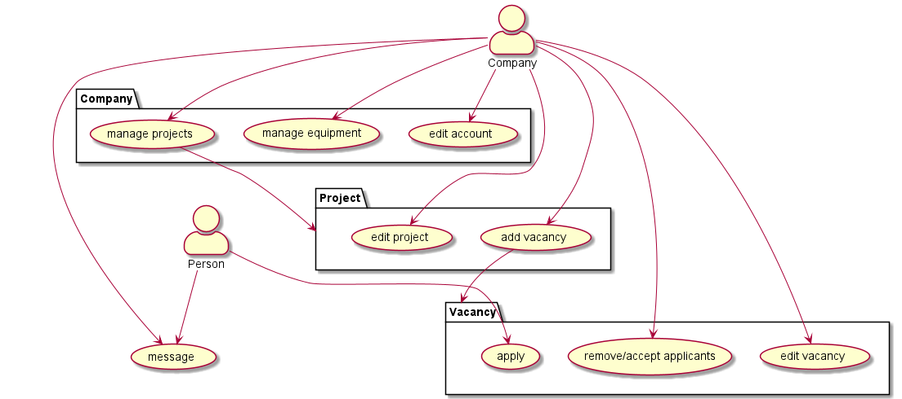
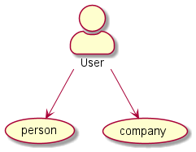

# Pflichtenheft - DirectorsView

Version: 1.0

Autor: Jonas Wiesinger 

| Projektbezeichnung             | Directors View                         |
| ------------------------------ | -------------------------------------- |
| Projektteilnehmer              | Knogler Simon, Wiesinger Jonas         |
| ProjektbetreuerIn / AuftraggeberIn | Engleitner Patricia, Aberger Christian |
| Institut                       | HTL Leonding                           |

## 1. Beschreibung der Ausgangssituation

Medienagenturen, Selbstständige und Hobbyisten im Video- und Fotografie Bereich haben oft Probleme damit, Projekte 
und die damit verbundenen Aufgaben gesammelt zu verwalten und verlieren schnell den Überblick wer bei welchem Projekt 
mitwirkt und welches Equipment genutzt wird. 

## 2. Istzustand

Es gibt Plattformen, die speziell für das Suchen von Mitarbeitern konzipiert sind und es gibt Websites, 
welche für die Organisation von Projekten innerhalb von Firmen gebaut wurden. Auf dem Markt fehlt eine 'Allrounder'-Plattform, 
welche das Projektmanagement von filmischen Projekten und die Jobbörse verknüpft.

## 3. Problemstellung

Viele Freelancer haben das Problem, dass einige möglicherweise perfekt auf sie passenden Jobausschreibungen aufgrund 
der Vielzahl an Plattformen übersehen und verpasst werden. Darüber hinaus haben Firmen das Problem, dass sie aufgrund 
dessen ihre Stellenangebote oftmals auf mehreren Kanälen und Plattformen gleichzeitig ausstrahlen müssen. 
Diese Aufteilung auf mehrere Plattformen kann auch seitens der Firma für Verwirrungen und Fehler führen.

Ein weiteres Problem von Filmfirmen ist, dass da oft mehrere Projekte gleichzeitig laufen, ein eingeplantes 
Gerät bereits woanders im Einsatz ist. Die daraufhin spontanen oder kurzfristigen Lösungen können sich negativ auf die 
Produktionsqualität auswirken.

## 4. Aufgabenstellung

### 4.1. Funktionale Anforderungen

#### 4.1.1. Anwendungsfalldiagramm (Use-Case-Diagram)

Dieses Use-Case-Diagramm zeigt einen groben Überblick über alle Aktionen, die ein Benutzer vornehmen kann. Wegen seiner Komplexität und seiner Grobheit sehen Sie unterhalb ein paar detailliertere Versionen. 

Alle anderen UCD finden Sie [hier](https://github.com/DirectorsView/documentation/tree/main/ucd).

Bei der Erstellung eines Accounts, kann der Benutzer zwischen einem *Firmenkonto* und einem *Benutzerkonto* wählen

### 4.2. Nicht-funktionale Anforderungen

Die Oberfläche ist ohne jegliches Vorwissen intuitiv steuerbar bzw. benutzbar. Die Responsive UI macht es den Nutzern möglich, jederzeit und überall auf alle Funktionen zugreifen zu können. Darüber hinaus sind die Ladezeiten kurz und effizient. Das Produkt soll später auch zweisprachig (Deutsch, Englisch) verfügbar sein. Die Daten und Passwörter müssen geschützt und für Dritte nicht einsehbar sein.

## 5. Zielsetzung

Es wird eine funktionierende Webapplikation erstellt, welche mithilfe von einem Quarkus Server und einer PostgreSQL Datenbank es Firmen und Selbständigen ermöglicht einfach und schnell Projekte zu erstellen und zu verwalten. Es können Mitarbeiter einer Firma zugeteilt werden, welche dann von Projektmanagern zu Projekten hinzugefügt werden können. Aber auch Selbstständige Personen können sich für freie Stellen, welche von Firmen ausgeschrieben wurden bewerben und können bei einer akzeptierten Bewerbung zu dem jeweiligen Projekt hinzugefügt werden. Firmen können außerdem das Equipment verwalten, indem verschiedene Ausrüstungsgegenstände Projekten zugeteilt werden und somit nicht mehr für andere zu dem Zeitpunkt verfügbar sind.

## 6. Lieferumfang

Der Benutzer bekommt eine multi-funktionale Plattform, bei der er entweder seine eigene Firma, oder sich selbst als 
Freelancer verwalten kann. 
