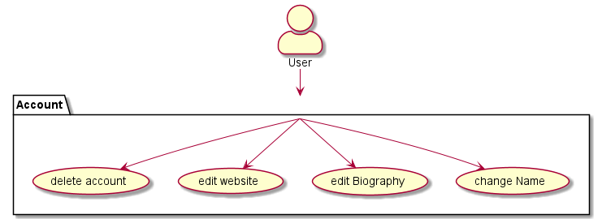
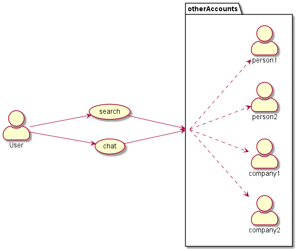
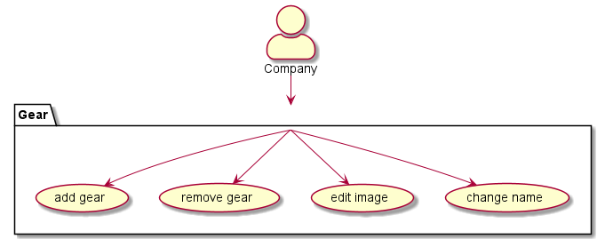
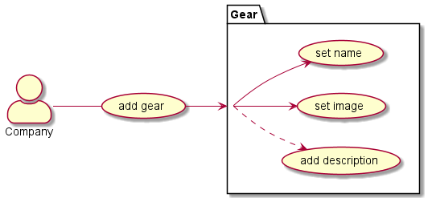
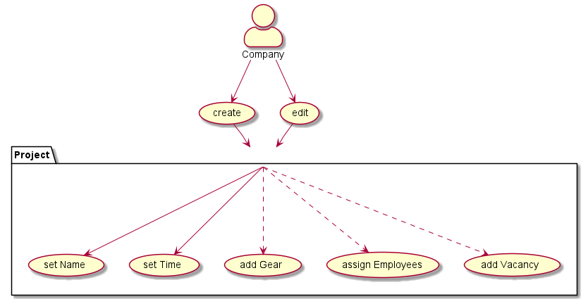
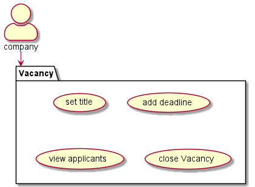
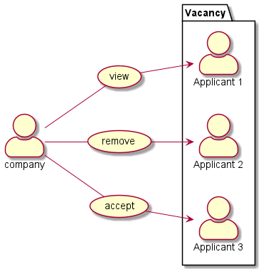

# Directors View - Use/Case Diagram
#### Overview

This Use/Case Diagram shows a rough overview over all the relations and actions a user can make. 
Because of its complexity and its inaccuracy you'll see more detailed versions on this page.

---
#### Creating an account

When creating an account, the user can choose between "person" and "company".

Regardless of his decision, the user has a few actions he can take to personalise his account

The user can always search and chat with other accounts

#### Company Account
###### the following diagrams only apply to company accounts

In this diagram you can see the actions that can be made to the gear of the users company.

If a user wants to add some type of gear to his company, he needs to set the name and the image
and he can also add an optional description.

When company creates a project, they have to set its name and its time.
The name can later be changed, the time is not changeable. Furthermore they can add Gear from their inventory, assign their employees,
or add a vacancy for the specific project.

A company can also advertise a job offer for their company.

No matter if the vacancy is for a project or for the company, the user can always view, remove or delete applicants.

