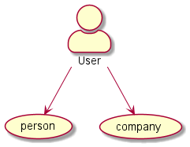

# Directors View - Use/Case Diagram
##### Overview

This Use/Case Diagram shows a rough overview over all the relations and actions a user can make. 
Because of its complexity and its inaccuracy you'll see more detailed versions on this page.
---
##### Creating an account

When creating an account, the user can choose between "person" and "company".

Regardless of his decision, the user has a few actions he can take to personalise his account

